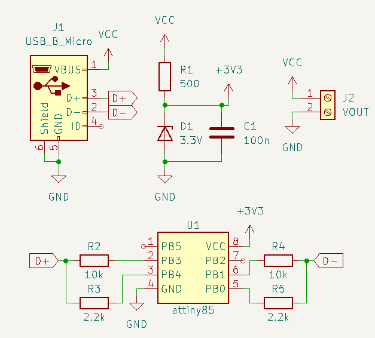
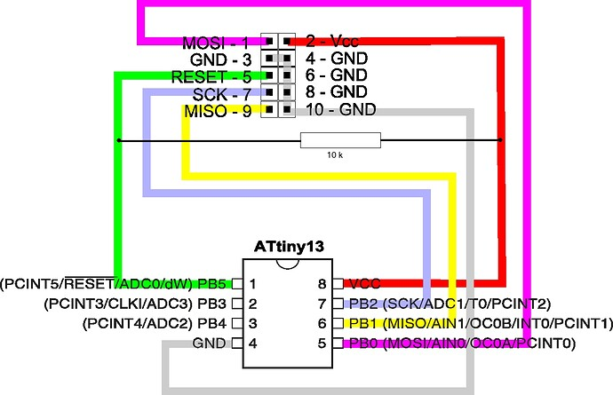

# Introduction
A small program that allows for any microcontroller with GPIO to send quick charge 3.0 commands.

Allows for setting of different voltage ranges from a quick charge supported power bank.
Vout = 5V, 9V, 12V, 20V, CONTINUOUS.

CONTINUOUS allows you to increment/decrement the voltage in 0.2V increments for finer control.

## Schematic

# Install instructions
1. Construct above circuit
2. Download <code>QuickChargeTrigger.hex</code> from releases
3. Connect attiny85 to USBASP 

4. Open your terminal inside <code>./install</code> folder
5. Run <code>avrdude.exe -C avrdude.conf -c usbasp -p t85 -B 16 -U flash:w:"QuickChargeTrigger.hex":i -P usb</code>
6. Verify that the output was successful in terminal

# Build instructions
1. Clone the repository
2. Open the ATMEL studio editor by opening the .atsln file 
3. Build the solution
4. Upload the generated <code>QuickChargeTrigger.hex</code> file using the method specified in installation instructions

